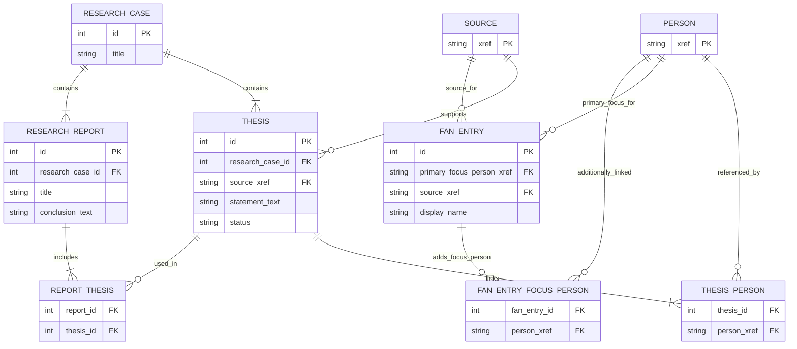

The following ER diagram shows the persisted MVP domain model of the Research Manager.

It includes:
- core persisted entities
- required fields only
- linking tables
- cardinalities

It does not include derived views such as Research Context, Extracted Theses, or FAN, because these are not persisted domain entities in MVP.
## MVP Entity Relationship Diagram

