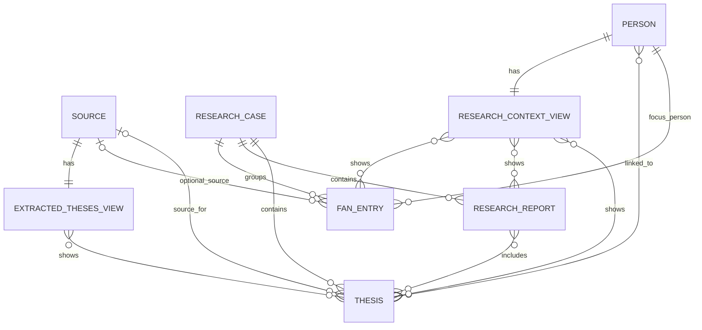

````md

```mermaid
erDiagram
    PERSON ||--o{ FAN_ENTRY : focus_person
    PERSON o{--o{ THESIS : linked_to
    SOURCE o|--o{ THESIS : source_for
    SOURCE o|--o{ FAN_ENTRY : optional_source

    RESEARCH_CASE ||--o{ THESIS : contains
    RESEARCH_CASE ||--o{ RESEARCH_REPORT : contains
    RESEARCH_CASE ||--o{ FAN_ENTRY : groups

    RESEARCH_REPORT o{--o{ THESIS : includes

    PERSON ||--|| RESEARCH_CONTEXT_VIEW : has
    SOURCE ||--|| EXTRACTED_THESES_VIEW : has

    RESEARCH_CONTEXT_VIEW }o--o{ THESIS : shows
    RESEARCH_CONTEXT_VIEW }o--o{ RESEARCH_REPORT : shows
    RESEARCH_CONTEXT_VIEW }o--o{ FAN_ENTRY : shows
    EXTRACTED_THESES_VIEW }o--o{ THESIS : shows
```
