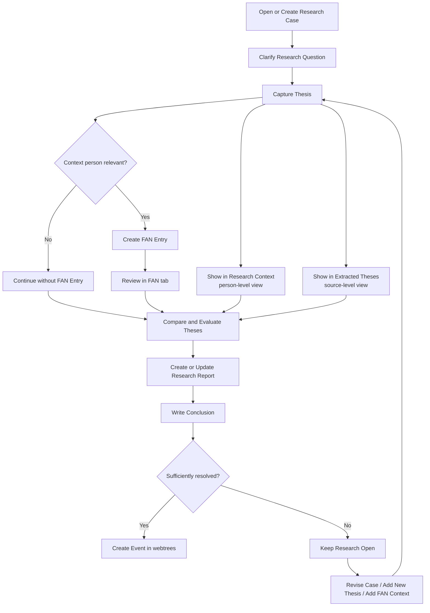

# Workflow

```mermaid
flowchart TD
    A[Open or Create Research Case] --> B[Clarify Research Question]
    B --> C[Capture Thesis]
    
    C --> D[Show in Research Context<br/>person-level view]
    C --> E[Show in Extracted Theses<br/>source-level view]
    
    C --> F{Context person relevant?}
    F -- Yes --> G[Create FAN Entry]
    F -- No --> H[Continue without FAN Entry]
    G --> I[Review in FAN tab]
    H --> J[Compare and Evaluate Theses]
    I --> J

    D --> J
    E --> J

    J --> K[Create or Update Research Report]
    K --> L[Write Conclusion]

    L --> M{Sufficiently resolved?}
    M -- Yes --> N[Create Event in webtrees]
    M -- No --> O[Keep Research Open]

    O --> P[Revise Case / Add New Thesis / Add FAN Context]
    P --> C
```
